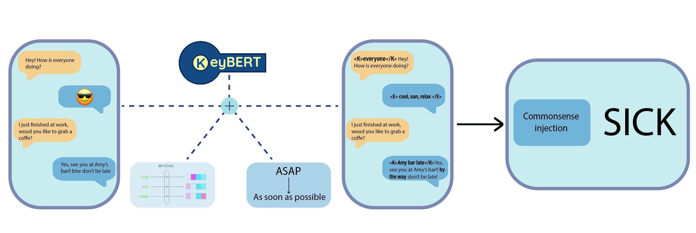

# Enhanced Abstractive Chat Summarization

## Overview


 


This repository features our inventive approach to abstractive chat summarization, titled "Leveraging Emojis, Keywords, and Slang for Enhanced Abstractive Chat Summarization." While deriving insights from prior research in the field, we have developed our own implementation to improve existing techniques. Our enhancements include integrating emojis, keywords, and handling of slang, all aimed at enhancing the overall quality of generated summaries.

The paper is available at the following [link](https://drive.google.com/file/d/1KXCmFDLEX84-FqeNv30Ni0ddpyhPUhuj/view?usp=sharing).

## Abstract

In this study, we present innovative enhancements to the abstractive chat summarization task. Our approach extends previous research that emphasized the advantages of injecting commonsense knowledge into dialogue summarization. The primary focus of our extensions includes:

1. **Emojis Analysis::** We investigate the importance of emojis in dialogues and chat-like conversations. Emojis are explored as a rich source of information that can contribute to the generation of summaries with increased accuracy and contextual relevance.

2. **Keywords Extraction:** We explore the impact of injecting keywords into the summarization process. Our findings highlight the beneficial role of keywords in improving the quality of dialogue summaries.

3. **Slang Preprocessing:** We introduce a preprocessing technique to effectively handle slang in conversations. This addition aims to enhance the comprehensibility of generated summaries in the context of informal language use.

The results obtained from our framework show promising outcomes, indicating the potential for improved abstractive chat summarization. We believe that our contributions provide a valuable foundation for future research endeavors in this field.

## Setting
To utilize our enhanced abstractive chat summarization framework we suggest the use of Google Colab and the execution of the following steps.

Clone the repository:
```
git clone https://github.com/al3ssandrocaruso/Enhanced-Abstractive-Chat-Summarization.git
```
Run these commands:
```
!pip install -r requirements.txt
!sudo apt-get update -y
!sudo apt-get install python3.8
!sudo update-alternatives --install /usr/bin/python3 python3 /usr/bin/python3.8 1
!sudo update-alternatives --config python3
!sudo apt install python3-pip
!sudo apt install python3.8-distutils
!python -m spacy download en_core_web_sm
```

### Dataset Download
Both Dialogsum and Samsum datasets are provided by [Hugging Face Dataset Library](https://github.com/huggingface/datasets). Dialogsum, however, is also provided at this link:
```
https://drive.google.com/drive/folders/1plWw-jWvYo0QZsr1rv9BtXb0dYuRPsv1?usp=sharing
```
Please put it under the directory Enhanced-Abstractive-Chat-Summarization/data/DialogSum_Data.
```
mkdir data/DialogSum_Data
```

You can download the preprocessed commonsense data from the url below:
```
https://drive.google.com/drive/folders/14Ot_3jYrXCONw_jUDgnCcojbFQUA10Ns?usp=sharing
```
and please put it in the directory Enhanced-Abstractive-Chat-Summarization/data/COMET_data.
```
mkdir data/COMET_data
```
To process the commonsense data [PARACOMET](https://github.com/skgabriel/paracomet) was used.

### Pretrained W2V
Our pretrained Word2Vec (W2V) models, including both the version trained on the [twitter dataset](https://drive.google.com/file/d/1QIohtJ1p3UGqcVMRzK7HG45uFqhC7sMz/view?usp=sharing) and the one fine-tuned on the Samsum corpus, are accessible through this link:
```
https://drive.google.com/drive/folders/1q8QOSHmAudSsRqEKhAu5fgcHKbsj8ooD?usp=sharing
```

### Weights
The pretrained models referenced in our paper are available at the following link:
```
https://drive.google.com/drive/folders/1KDzAvghktpFB3HPRDOY1xJQUp62r0ARe?usp=sharing
``` 

## Train
To train the original SICK model execute the following command: 

```
!python3 ./Enhanced-Abstractive-Chat-Summarization/src/train_summarization_context.py --finetune_weight_path="./new_weights_sick" --best_finetune_weight_path="./new_weights_sick_best" --dataset_name="samsum" --use_paracomet=True --model_name="facebook/bart-large-xsum" --relation "xIntent" --epoch=1 --use_sentence_transformer True
```

In order to include our extensions please add the following parameters (singularly or as in supported combinations below):  

- emoji_m0 : If True emojis in the dataset are replaced with their aliases.
- emoji_m1 : If True it replaces emojis in the dataset with custom tokens containing their most similar words based on a W2V model which was trained on a twitter dataset and finetuned on Samsum dataset.
- keyword : If True KeyBert is used to build and add to the dataset new custom tokens containing the keywords it is capable to retrieve from each utterance. 
- slang : If True the model is trained on a dataset in which slang expressions and abbreviations are replaced with their corresponding actual meaning.

As for now, the supported combinations of these parameters are: ```emoji_m1 + slang + keyword```, ```emoji_m1 + keyword```

*Note*: our implementations only work with Samsum dataset.

We suggest to use different values for the ```--finetune_weight_path``` and ```--best_finetune_weight_path``` parameters on different runs to then be able to infer using all the models you trained by using the differently-named checkpoints (to be given as ```--model_checkpoint``` parameter to inference.py) 


## Inference
Obtain inferences executing the next command:
```
!python3 /content/Enhanced-Abstractive-Chat-Summarization/src/inference.py --dataset_name "samsum" --model_checkpoint="./new_weights_sick_best" --test_output_file_name="./summaries.txt" --use_paracomet True --num_beams 20 --train_configuration="full" --use_sentence_transformer True
```
Make sure to be using the right value for the ```--model_checkpoint``` parameter if you trained the model more than once using different extensions.
